# 🔬 dynamic-ml-visualizer

An interactive, containerized machine learning application that trains a PyTorch neural network on the a Dataset and visualizes the outcomes using Matplotlib. 

### Demo


https://github.com/user-attachments/assets/cdcdfec1-8220-4d51-97ed-47ff129eee8c


### 🧠 Model Architecture

```mermaid
graph TD
    A[Input Layer<br>Dynamic Size] --> B[Dense + ReLU + Dropout 0.2]
    B --> C[Dense + ReLU + Dropout 0.2<br>Compressed Size]
    C --> D[Dense 1 + Sigmoid]
    D --> E((Output: 0.0 to 1.0))
    
    style A fill:#161616,stroke:#333,stroke-width:2px
    style E fill:#13431b,stroke:#28a745,stroke-width:2px
```


Key Model Design Choices
- Dynamic Input Layer: The model automatically re-initializes its input dimension when the user swaps datasets (e.g., 30 features for Cancer, 15 for Churn).
- Dropout (p=0.2): Randomly disables 20% of neurons during training to prevent overfitting on small datasets.
- Sigmoid Output: Compresses the final neuron into a probability, thresholded at 0.5 for binary classification.

### 📁 Project Structure
```
cancer-predictor/
├── .github/
│   └── workflows/
│       └── ci.yml
├── docker-compose.yml      
├── Dockerfile.api          
├── Dockerfile.ui           
├── requirements.txt        
├── src/
│   ├── model.py            
│   ├── api.py              
│   └── ui/
│       └── ui.py           
└── README.md
```

### ⚙️ Tech Stack
```
Language: Python 3.10
API Framework: FastAPI + Uvicorn
Deep Learning: PyTorch (Feedforward Neural Network)
Data Processing: NumPy, Pandas, Scikit-learn (PCA, StandardScaler, SVM)
Visualization: Matplotlib (Agg backend for containerized base64 encoding)
Frontend: Streamlit
Containerization: Docker
Orchestration: Docker Compose
CI/CD GitHub Actions
```

### 🚀 Quick Start 
Prerequisites 

     Docker Desktop  installed and running.
     Python 3.10+ installed
     

Run the Application 

Clone or download this repository. 
Open a terminal in the project root directory. 
Run the following command:
```   
docker compose up --build  
```
      
Wait for the terminal to display: You can now view your Streamlit app in your browser. 
Open your browser and navigate to: http://localhost:8501  

(To stop the application, press Ctrl+C in your terminal). 
